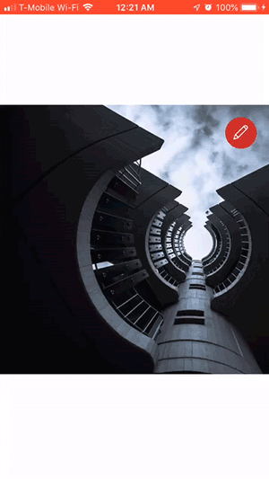

# React Native ImageEdit

This React Native component `ImageEdit` allows you to edit images inline for cropping. This component will provide you all the measurements you need for cropping so you can finish up with the cropping from a server or from other sources.

## Updates
### V1.1.0
* Video Support
* Improvements
* Bug Fixes
* New prop: `scaled`
### V1.0.2
* Fixed `resolveAssetSource` import.
* Added 2 new props `saveButtonText` and `cancelButtonText`.

### V1.0.1
* Fixed `componentWillReceiveProps` deprecation.

## Installation

```
npm install react-native-imageedit --save
```

## Screenshots


## Simple Usage

Import
```jsx
import ImageEdit from 'react-native-imageedit'
```
Render
```jsx
//Simple

<ImageEdit
  image="https://source.unsplash.com/daily" //Image/Video uri
  onSave={info => console.log(info)}
/>

//Local Image

<ImageEdit
  image={require('./path/to/image-or-video.jpg')}
  onSave={info => console.log(info)}
/>

//Image object

<ImageEdit
  width={400} //Crop area width
  height={300} //Crop area height
  image={{
          uri :"https://source.unsplash.com/daily", 
          width: 1000, 
          height: 500
          }}
  onSave={info => console.log(info)}
/>

//OR for custom buttons

<ImageEdit
    showEditButton={false}
    showSaveButtons={false}
    image="https://source.unsplash.com/daily" //Image uri
    ref={ref=>this._imageEdit = ref}
>
    <TouchableOpacity onPress={()=> console.log(this._imageEdit.getInfo())}>
        <Text>Custom Button</Text>
    </TouchableOpacity>
</ImageEdit>

//Initial scaling and positioning

<ImageEdit
  width={400}
  height={300}
  scaled={true} //To enable pre scaling and positioning
  image={{
          uri :"https://source.unsplash.com/daily", 
          width: 1200, //initial width
          height: 700, //initial height
          x: -100, //initial x
          y: -230 //initial y
          }}
/>

```

## Props

|Prop|Type|Description|
|----|----|-----------|
|width|Number|Crop area width. Default: window width|
|height|Number|Crop area height. Default: window width|
|image|Object, String|Image object or uri string. Required|
|editing|Bool|Editing mode. Default: false|
|cropIn|Bool|Allow to crop smaller that the crop area. Default: false|
|showEditButton|Bool|Show edit button. Default: true|
|showSaveButtons|Bool|Show save buttons. Default: true|
|saveButtonText|String|Save button text. Default: Save|
|cancelButtonText|String|Cancel button text. Default: Cancel|
|showGrids|Bool|Show grids while editing. Default: true|
|containerStyle|Object|Component container style|
|areaStyle|Object|Crop area container style|
|gridStyle|Object|Grid line style|
|gridColor|Object|Grid line color|
|buttonsColor|String|Buttons color|
|onEdit|Func|Edit button onPress callback|
|onSave|Func|Save button onPress callback. Will pass cropping info object as argument|
|onCancel|Func|Cancel button onPress callback|
|scaled|Bool|If true, Image Object size and position x ,and y will initially be kept. This is used to pre position or pre scale the image or video. Default: false|

## Methods

|Method|Description|
|------|-----------|
|enable()|Switch to editing mode|
|disable()|Disable editing mode|
|getInfo()|Returns cropping info object|

## Cropping Info Object

```jsx
{
    area: {
        width: 500,
        height: 400
    },
    image: {
        uri: "https://source.unsplash.com/daily",
        width: 800,
        height: 650,
        x: -100,
        y: -55
    }
}

```
You will need this data for image cropping from server or other places. Hopefully in the future we will be able to crop the images right from this component.
